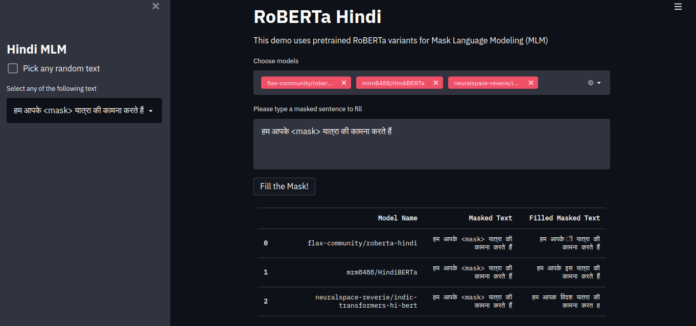

# RoBERTa Hindi

HuggingFace Flax-Community Project Forum link  : https://discuss.huggingface.co/t/pretrain-roberta-from-scratch-in-hindi

## Project Idea:
Pretrain RoBERTa for Hindi Language and compare the performance on various down stream tasks with existing models

## Demo:

[Check out the Demo here!](https://huggingface.co/spaces/flax-community/roberta-hindi)



## Example code to use our Model for Mask Filling Task:
```python
from transformers import AutoTokenizer,AutoModelForMaskedLM
from transformers import pipeline

tokenizer = AutoTokenizer.from_pretrained(model_name)
model = AutoModelForMaskedLM.from_pretrained(model_name, from_flax=True)

nlp = pipeline('fill-mask', model=model, tokenizer=tokenizer)
masked_text = 'हम आपके <mask> यात्रा की कामना करते हैं'
result = nlp(masked_text)
result

"""
Output:
हम आपके ी यात्रा की कामना करते हैं
"""
```

## Our Results

## Contributors

## Future Work
Create the best Hindi Language Model to use in real world applications

